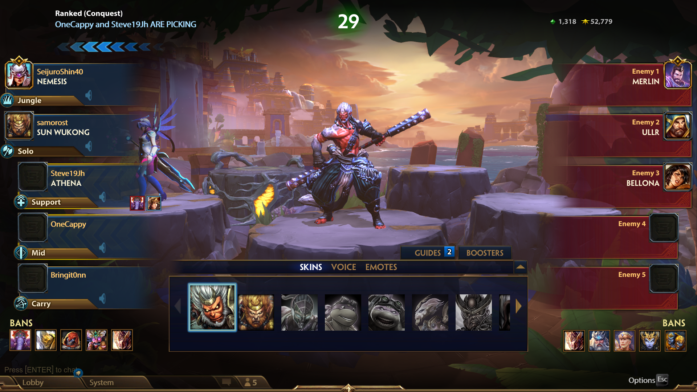

# Tattletale
A small Python curses script which takes a  screenshot of a Smite lobby and
looks up the MMR,  most played gods and recent matches (in ranked) of your
teammates using the Smite API.

For example, it turns this:



into this (SeijuroShin40 has a private profile, but interestingly  you can still
query for theirs most played gods):
```
Players:
  SeijuroShin40
  samorost
  Steve19Jh
  OneCappy
  Bringit0nn

SeijuroShin40---------------------------┐samorost--------------------------------┐Steve19Jh-------------------------------┐OneCappy--------------------------------┐Bringit0nn------------------------------┐
| Level: 0                              || Level: 94                             || Level: 89                             || Level: 130                            || Level: 97                             |
| Hours: 0                              || Hours: 651                            || Hours: 442                            || Hours: 1601                           || Hours: 525                            |
| Created: None                         || Created: 28/02/2014 22:46:39          || Created: 01/04/2016 23:58:29          || Created: 31/01/2013 11:21:32          || Created: 06/07/2018 19:38:15          |
| Status: None                          || Status: Siemka4 je kamarád :)         || Status: twitch.tv/Steve19Jh           || Status: Labdien                       || Status:                               |
| Alt name: None                        || Alt name: [pen1z]samorost             || Alt name: [TTVP]Stev19Jh              || Alt name: [TR27]OneCappy              || Alt name: suuuuu                      |
| Ranked conquest                       || Ranked conquest                       || Ranked conquest                       || Ranked conquest                       || Ranked conquest                       |
|   MMR: 0                              ||   MMR: 1538                           ||   MMR: 1529                           ||   MMR: 1510                           ||   MMR: 1527                           |
|   Matches: 123                        ||   Matches: 350                        ||   Matches: 283                        ||   Matches: 2593                       ||   Matches: 604                        |
|   Last: None                          ||   Last: 55 minutes ago                ||   Last: 55 minutes ago                ||   Last: 55 minutes ago                ||   Last: 55 minutes ago                |
|   Most played gods                    ||   Most played gods                    ||   Most played gods                    ||   Most played gods                    ||   Most played gods                    |
|     Ne Zha                            ||     Eset                              ||     Janus                             ||     Discordia                         ||     Chernobog                         |
|       Matches: 16 (13%)               ||       Matches: 35 (10%)               ||       Matches: 72 (25%)               ||       Matches: 82 (3%)                ||       Matches: 101 (17%)              |
|       Wins: 9 (56%)                   ||       Wins: 23 (66%)                  ||       Wins: 36 (50%)                  ||       Wins: 41 (50%)                  ||       Wins: 53 (52%)                  |
|       Last: 7 years and 1 months ago  ||       Last: 1 years and 10 months ago ||       Last: 2 months and 5 days ago   ||       Last: 2 months and 19 days ago  ||       Last: 1 years and 5 months ago  |
|     Nemesis                           ||     Janus                             ||     Sobek                             ||     Ah Puch                           ||     Agni                              |
|       Matches: 15 (12%)               ||       Matches: 26 (7%)                ||       Matches: 70 (25%)               ||       Matches: 77 (3%)                ||       Matches: 62 (10%)               |
|       Wins: 9 (60%)                   ||       Wins: 17 (65%)                  ||       Wins: 36 (51%)                  ||       Wins: 46 (60%)                  ||       Wins: 34 (55%)                  |
|       Last: 16 minutes ago            ||       Last: 5 years and 6 months ago  ||       Last: 11 months and 1 days ago  ||       Last: 16 minutes ago            ||       Last: 1 months and 4 days ago   |
|     Thanatos                          ||     Scylla                            ||     Arachne                           ||     Ra                                ||     Anhur                             |
|       Matches: 8 (7%)                 ||       Matches: 24 (7%)                ||       Matches: 21 (7%)                ||       Matches: 62 (2%)                ||       Matches: 50 (8%)                |
|       Wins: 6 (75%)                   ||       Wins: 11 (46%)                  ||       Wins: 13 (62%)                  ||       Wins: 32 (52%)                  ||       Wins: 30 (60%)                  |
|       Last: 10 hours and 55 minute... ||       Last: 11 months and 27 days ago ||       Last: 2 months and 3 days ago   ||       Last: 7 days ago                ||       Last: 1 days and 6 hours ago    |
|   Recent matches                      ||   Recent matches                      ||   Recent matches                      ||   Recent matches                      ||   Recent matches                      |
|                                       ||     Match #1                          ||     Match #1                          ||     Match #1                          ||     Match #1                          |
|                                       ||       Outcome: Loss                   ||       Outcome: Loss                   ||       Outcome: Loss                   ||       Outcome: Loss                   |
|                                       ||       Length: 32m                     ||       Length: 32m                     ||       Length: 32m                     ||       Length: 32m                     |
|                                       ||       Role: Solo                      ||       Role: Support                   ||       Role: Mid                       ||       Role: Carry                     |
|                                       ||       God: Sun_Wukong                 ||       God: Athena                     ||       God: Ah_Puch                    ||       God: Skadi                      |
|                                       ||       KDA: 7/3/11                     ||       KDA: 6/6/14                     ||       KDA: 3/9/4                      ||       KDA: 1/12/5                     |
|                                       ||     Match #2                          ||     Match #2                          ||     Match #2                          ||     Match #2                          |
|                                       ||       Outcome: Win                    ||       Outcome: Win                    ||       Outcome: Win                    ||       Outcome: Win                    |
|                                       ||       Length: 29m                     ||       Length: 27m                     ||       Length: 30m                     ||       Length: 24m                     |
|                                       ||       Role: Jungle                    ||       Role: Support                   ||       Role: Mid                       ||       Role: Carry                     |
|                                       ||       God: Osiris                     ||       God: Athena                     ||       God: Aphrodite                  ||       God: Skadi                      |
|                                       ||       KDA: 6/7/11                     ||       KDA: 1/6/11                     ||       KDA: 1/2/14                     ||       KDA: 5/5/10                     |
|                                       ||                                       ||     Match #3                          ||     Match #3                          ||     Match #3                          |
|                                       ||                                       ||       Outcome: Loss                   ||       Outcome: Win                    ||       Outcome: Win                    |
|                                       ||                                       ||       Length: 36m                     ||       Length: 28m                     ||       Length: 27m                     |
|                                       ||                                       ||       Role: Mid                       ||       Role: Mid                       ||       Role: Carry                     |
|                                       ||                                       ||       God: Poseidon                   ||       God: Poseidon                   ||       God: Skadi                      |
|                                       ||                                       ||       KDA: 1/10/7                     ||       KDA: 13/5/8                     ||       KDA: 5/3/9                      |
|                                       ||                                       ||                                       ||                                       ||                                       |
└---------------------------------------┘└---------------------------------------┘└---------------------------------------┘└---------------------------------------┘└---------------------------------------┘    
```
The names in the top part are editable, allowing one to fix  up mistakes done by
the OCR.

## Usage
I wrote this for my own usage, so it requires a bit of setup:

0) I think the curses module is not present in the Windows version of Python, so
[WSL](https://docs.microsoft.com/en-us/windows/wsl/) is needed.
1) Install [Tesseract OCR](https://github.com/tesseract-ocr/tesseract).
2) Download this repo, install requirements.txt etc.
3) Download [nircmd.exe](https://www.nirsoft.net/utils/nircmd.html) and put it 
next to the script (or somewhere in PATH).
4) Export your [Smite API](https://webcdn.hirezstudios.com/hirez-studios/legal/smite-api-developer-guide.pdf)
DevId and AuthKey in the SMITE_DEV_ID and SMITE_AUTH_KEY environment variables.
5) Join a Smite lobby on your first monitor (with a resolution of 1920x1080).
6) Run `python tattletale.py` in a terminal on your second monitor

Alternatively the scripts accepts as an argument a path to a screenshot:

`python tattletale.py readme/example.png`

or player names:

`python tattletale.py SeijuroShin40 samorost Steve19Jh OneCappy Bringit0nn`
